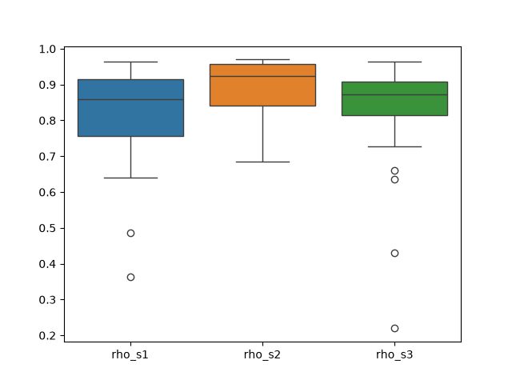
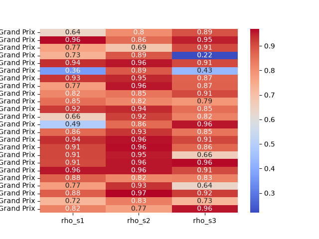
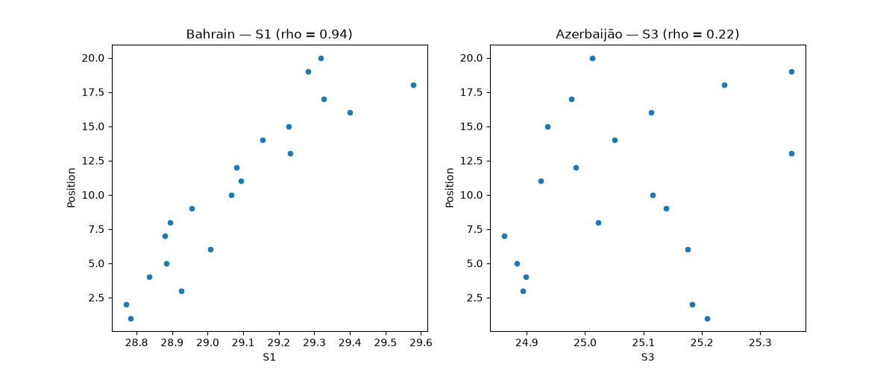
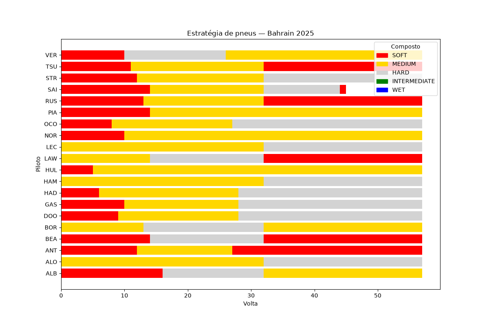
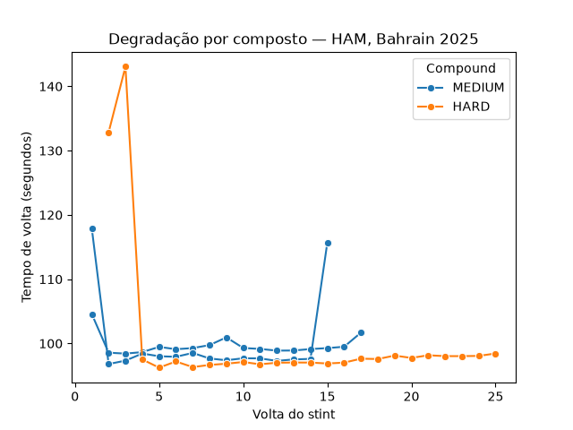

# box-box-analytics 🏎️

Projeto de portfólio de análise de dados em Python, com dados reais de telemetria da Fórmula 1 (temporada 2025 completa) via [FastF1](https://docs.fastf1.dev/).

## Objetivo

Responder perguntas analíticas sobre desempenho e estratégia na F1 usando dados oficiais de sessão (voltas, setores, pit stops, posições), com um pipeline reprodutível: coleta → processamento → análise estatística → visualização.

## Perguntas de análise

**1. Setores de quali vs. posição de grid** — o tempo de cada setor da qualificação se correlaciona com a posição final de largada? Algum setor é mais decisivo que os outros?

**2. Estratégia de corrida e ultrapassagens** — como pneus e pit stops afetam o resultado? 1 parada rende mais posições que 2? O undercut funciona? Em quais pistas se ultrapassa mais?

## Principais achados

### 1. Setores de quali vs. grid

A correlação foi calculada por corrida (Spearman, já que posição de grid é uma variável ordinal), não com a temporada toda misturada — tempos de setor não são comparáveis diretamente entre pistas diferentes.

- **S2 é o setor mais forte e mais consistente** (rho médio 0.89, desvio 0.075) — setor mais técnico/misto, onde o equilíbrio de setup aerodinâmico pesa mais.
- **S1 e S3** (dominados por retas) são mais instáveis (rho médio 0.81 e 0.82, desvios 0.15 e 0.18), com dois casos extremos: **Azerbaijão** (S3, rho = 0.22 — efeito de vácuo na maior reta da temporada) e **Bélgica** (S1 = 0.36, S3 = 0.43 — mesmo efeito em Eau Rouge/Kemmel).
- Conclusão geral: ser rápido no quali realmente se traduz em largar na frente — correlação forte e positiva nos três setores ao longo de toda a temporada.





### 2. Estratégia de corrida e ultrapassagens

A métrica de ultrapassagem separa a variação de posição volta a volta em dois componentes — **ultrapassagens reais** (na pista) e **mudança por pit stop** (tempo perdido no box) — porque o resultado líquido sozinho pode esconder a história real. Exemplo: VER em Bahrain 2025 terminou com saldo líquido de apenas -2, mas teve +22 de ultrapassagens reais na pista compensando -20 perdidos em dois pit stops caros.

**1 parada vs. 2 paradas:** mesma mediana de ultrapassagens líquidas (0.0) nos dois casos, com amostra grande (222 e 166 corridas/pilotos) — nenhuma das duas estratégias tem vantagem sistemática; a escolha depende da corrida específica.

**Undercut:** pilotos ganham posição acima da média da temporada logo nas primeiras voltas após um pit stop (-0.20 vs. -0.12 de média geral) — confirma que a vantagem do pneu novo aparece nos dados, mesmo sem conseguir isolar duelos específicos entre dois pilotos.

**Pistas com mais ultrapassagem** (movimentação de posição normalizada por volta): **Monaco em último** (1.24) — confirma ser a pista mais difícil de ultrapassar do calendário. **Bahrain (5.84) e São Paulo (5.00) no topo.**




## Como rodar

```bash
git clone https://github.com/sofiaxyz1/box-box-analytics.git
cd box-box-analytics

python3 -m venv .venv
source .venv/bin/activate        # Windows: .venv\Scripts\activate

pip install -r requirements.txt

jupyter lab
```

Os notebooks em `notebooks/` rodam na ordem numérica (01 → 04). O cache do FastF1 é baixado automaticamente na primeira execução de cada sessão (pode demorar alguns minutos); depois disso, lê do disco em segundos.

## Estrutura do repo

```
box-box-analytics/
├── notebooks/              # narrativa da análise, numerados em ordem de execução
│   ├── 01_exploracao_fastf1.ipynb
│   ├── 02_coleta_dados.ipynb
│   ├── 03_setores_vs_grid.ipynb
│   └── 04_estrategia_corrida.ipynb
├── src/
│   └── data_loader.py      # funções reutilizáveis de coleta e visualização
├── data/
│   ├── cache/               # cache do FastF1 (não versionado)
│   └── processed/           # CSVs processados (quali_2025, corridas_2025, correlações)
├── reports/
│   └── figures/             # gráficos exportados pelos notebooks
├── requirements.txt
└── README.md
```

## Limitações e próximos passos

- A análise de setores usa a **melhor volta real** de cada piloto (`pick_fastest()`), não a "volta ideal" (melhor tempo de cada setor somado) — essa comparação ficou fora do escopo.
- O undercut foi medido de forma agregada (ganho médio de posição logo após o pit), não isolando duelos diretos entre dois pilotos específicos — a granularidade de `LapNumber` (número inteiro de volta) não permite saber com certeza quem pitou primeiro quando duas paradas caem na mesma volta.
- Correlação não implica causalidade: os resultados de setores x grid mostram associação estatística forte, não uma relação causal comprovada — outros fatores (nível de combustível, modo de pneu, tráfego) influenciam os tempos de setor e não foram isolados.
- Próximo passo natural: regressão para prever a posição de grid a partir dos três setores e comparar a importância relativa de cada um (item opcional do roadmap, não implementado).

## Stack

Python, pandas, FastF1, matplotlib, seaborn, scipy, Jupyter.
